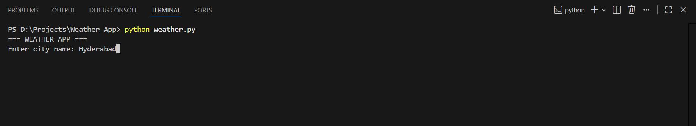
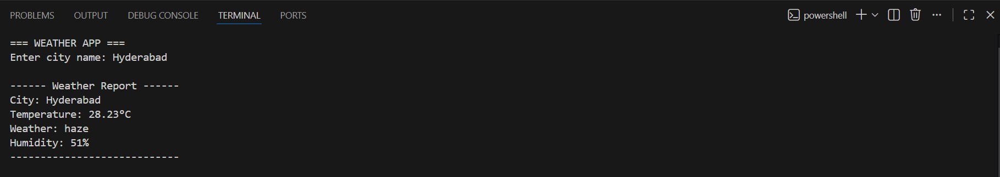

# 🌦 Weather App (Python CLI)

A simple and clean **Python command-line weather application** that shows **real-time weather information** for any city using the **OpenWeather API**.

---

## 🚀 Features

- Shows **temperature in °C**  
- Shows **weather description** (e.g., Clear, Rainy)  
- Shows **humidity**  
- Fetches **live data** from OpenWeather API  
- Beginner-friendly, clean Python code  

---

## 🧰 Tech & Concepts Used

- Python  
- Requests library (for API calls)  
- JSON parsing  
- Command-line interface (CLI)  
- API integration  

---

## 📦 Requirements

Install dependencies using pip:

```bash
pip install -r requirements.txt
▶ How to Run
Open terminal or command prompt

Navigate to project folder

Run:

bash
Copy code
python weather.py
Enter city name, e.g.:

yaml
Copy code
Enter city name: Mumbai
See output:

makefile
Copy code
------ WEATHER REPORT ------
City: Mumbai
Temperature: 32°C
Weather: clear sky
Humidity: 70%
----------------------------
## 🌈 Sample Output

Here are some sample screenshots of the app in action:

  
  



Make sure the images are inside a folder named images in your project folder.

🔑 API Key
Sign up at OpenWeather

Copy your API key

Replace "YOUR_API_KEY" in weather.py with your key

💻 How it Helps in Resume
Demonstrates API integration skills

Shows ability to work with Python & JSON

Clean CLI interface shows attention to user experience

Can be easily extended into GUI or Web App

📂 Folder Structure
markdown
Copy code
weather-app/
├── weather.py
├── README.md
├── requirements.txt
└── images/
    ├── screenshot1.png
    ├── screenshot2.png
    └── screenshot3.png
📝 License
MIT License © Madhav

yaml
Copy code

---

# ✅ **Important Fixes**

1. **Added proper line breaks** (`---` between sections) so GitHub renders formatting correctly.  
2. **Double spaces at line ends** after image lines:  

```markdown
  
This ensures the images appear on separate lines.
3. Used backticks properly for code blocks (```bash, ```) so terminal commands and outputs render correctly.